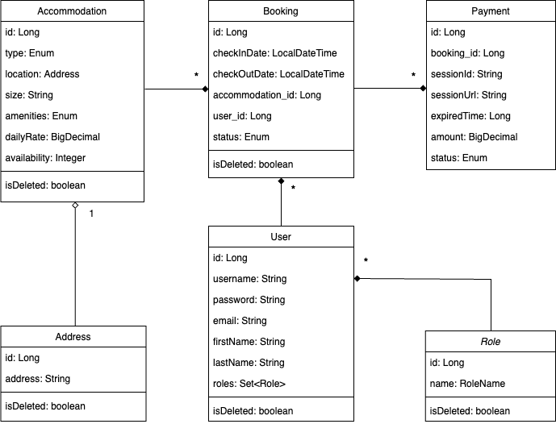

<p align="center">
  
</p>

## 🏡 Project description

---
**This Accommodation Booking and Management System allows users to browse and book accommodations, manage rental inventories, and handle payments securely through Stripe. 
The system provides role-based access, enabling administrators to manage accommodations and bookings, while customers can manage their personal bookings. 
Real-time notifications about bookings and payments are delivered through a Telegram bot. 
Built with Spring Boot, Liquibase for database management, and Docker for deployment, it offers RESTful APIs for CRUD operations, 
JWT-based authentication, and robust handling of accommodation availability, with automated booking expiration checks and session management for payments.**

## 🏖️ Features

---
**The system provides the following operations:**

<ins>***Accommodation Management***:</ins>
- ***Retrieve accommodation catalog:*** Fetch a list of available accommodations
- ***Retrieve accommodation details by ID:*** Get information about a specific accommodation
- ***Create a new accommodation:*** Add new accommodation to the inventory
- ***Update an existing accommodation:*** Modify details of an accommodation
- ***Delete an accommodation:*** Remove accommodation from the catalog (admin only)

<ins>***User Management***:</ins>
- ***User registration:*** Register new users with role-based validation and exception handling
- ***Update user role:*** Admins can update user roles (Customer/Manager)
- ***Retrieve user profile:*** Fetch profile details for the logged-in user
- ***Update user profile:*** Modify personal information for the logged-in user

<ins>***Booking Management***:</ins>
- ***Create a new booking:*** Book an available accommodation
- ***Retrieve user bookings:*** Fetch bookings for the logged-in user
- ***Retrieve bookings by status and user ID:*** Admins can access all user bookings
- ***Update a booking:*** Modify an existing booking's details
- ***Cancel a booking:*** Cancel a user's existing booking

<ins>***Payment Management (Stripe Integration)***:</ins>
- ***Initiate payment session:*** Create a payment session for booking
- ***Handle successful payment:*** Update booking status upon payment completion
- ***Handle canceled payment:*** Manage bookings after payment cancellation
- ***Retrieve payment information:*** Admins can fetch payment details by users id

<ins>***Notifications Service (Telegram)***:</ins>
- ***Booking notifications:*** Send messages for new/canceled bookings
- ***Payment success notifications:*** Notify about successful payments
- ***Accommodation release notifications:*** Inform about released accommodations

<ins>***Other***:</ins>
- ***Global Exception Handling:*** Centralized error handling for the application
- ***Scheduled tasks:*** Automatically mark expired bookings and send notifications
- ***Pagination & Sorting:*** Efficiently manage accommodation and booking listings

## 🪴 Project structure

---
**The application follows a 3-tier architecture:**
- ***Controller Layer:*** Handles HTTP requests and responses, managing user interactions with the system.
- ***Service Layer:*** Contains business logic, interacting between the controller and repository layers.
- ***Repository Layer:*** Provides data access using JpaRepository for database operations, managing entities.

**The entities involved in this project include:**
- ***Accommodation:*** Represents an available property for booking.
- ***Address:*** Stores accommodation-related addresses.
- ***User:*** Represents a customer or manager with personal and authentication details.
- ***Role:*** Defines user roles, such as USER and ADMIN, to manage access control.
- ***Booking:*** Manages booking details, including dates, associated accommodation, user, and status.
- ***Payment:*** Handles Stripe payment processing, tracking sessions, amounts, and status.
- ***TelegramBotChat:*** Manages chat interactions for notifications, storing chat information.



## 🔬 Used technologies

---
**The following technologies were used:**
- Spring Boot (Java framework for building the API)
- Spring Security (Authentication and authorization management with JWT)
- Spring Data JPA (Database interaction with relational databases)
- PostgreSQL (Relational database for persistent storage)
- Hibernate (ORM tool for managing database operations)
- Liquibase  (Database migrations and version control)
- Stripe API (Payment processing integration)
- Telegram API (Real-time notifications through Telegram)
- Docker & Docker Compose (Containerization and environment management)
- JUnit & Mockito (Unit testing and mocking)
- Swagger (API documentation and testing)
- Maven (Build automation tool)
- Postman (API testing tool)

## 🚀 How to run the project

---
**To start the project you need to do the following:**
1. Download the [Project](https://github.com/serhii-shyian/stayfinder-app) from GitHub and save it
2. Download [JDK](https://www.oracle.com/java/technologies/downloads/) and install it on computer
3. Download [IntelliJ IDEA](https://www.jetbrains.com/idea/download) and install it on computer
4. Download [PostgreSQL](https://www.enterprisedb.com/downloads/postgres-postgresql-downloads) and install it on computer
5. Download [pgAdmin](https://www.pgadmin.org/download/) and install it on computer
6. Download [Docker](https://www.docker.com/products/docker-desktop/) and install it on computer
7. Open IntelliJ IDEA and load the previously saved project
8. Create database for the project using pgAdmin of using terminal
```java
psql postgres;

CREATE DATABASE your_database_name;
```
9. Register your [Stripe](https://dashboard.stripe.com/register) account and get Api secret key for testing
10. Register your Telegram bot in [BotFather](https://t.me/BotFather) and get Api key for testing
11. Create the .env file using .env.sample (in the root of the project) like in example below 
```java
DB_NAME=your_database_name
DB_USER=your_database_user
DB_PASSWORD=your_database_password

JWT_EXPIRATION=86400000
JWT_SECRET=your_jwt_secret_here

STRIPE_SECRET_KEY=your_stripe_api_secret_key_here
STRIPE_SUCCESS_URL=http://localhost:8080/api/payments/success
STRIPE_CANCEL_URL=http://localhost:8080/api/payments/cancel
STRIPE_SESSION_PLACEHOLDER={CHECKOUT_SESSION_ID}
STRIPE_SESSION_REQUEST=sessionId
STRIPE_DEFAULT_QUANTITY=1
STRIPE_DEFAULT_CURRENCY=usd
STRIPE_CENTS_AMOUNT=100

BOT_NAME=your_bot_name
BOT_KEY=your_bot_api_key
BOT_EMAIL_REGEX=^[a-zA-Z0-9._%+-]+@[a-zA-Z0-9.-]+\.[a-zA-Z]{2,}$

POSTGRES_LOCAL_PORT=5433
POSTGRES_DOCKER_PORT=5432
SPRING_LOCAL_PORT=8088
SPRING_DOCKER_PORT=8080
DEBUG_PORT=5005
```
12. To run the project press the Run button
13. The application will be accessible at http://localhost:8080.
14. To run the project using Docker Compose execute the following command in the terminal:
```java
mvn clean package

docker-compose up
```
15. The application will be accessible at http://localhost:8088.

## 🤖 How to test the project

---
**Register at [Postman](https://www.postman.com/) and start testing the service**

You can import a collection of test queries from **postman_local.json** (/postman_local.json)
or **postman_docker.json** (/postman_docker.json) from the project folder if running locally or running via docker respectively, 
or use the following login and password to create test queries manually.
```java
#Admin role
login: admin@i.ua;
password: qwerty;
```

| **Http** | **Endpoint**         | **Roles**     | **Description**                                            |
|----------|----------------------|---------------|------------------------------------------------------------|
| POST     | /auth/login          | ALL           | Authenticate user with email and password                  |
| POST     | /auth/register       | ALL           | Register new user with email and password                  |
| POST     | /accommodations      | ADMIN         | Add a new accommodation                                    |
| GET      | /accommodations      | AUTHENTICATED | Get all available accommodations                           |
| GET      | /accommodations/{id} | AUTHENTICATED | Get details of a specific accommodation by its ID          |
| PUT      | /accommodations/{id} | ADMIN         | Update details of a specific accommodation                 |
| DELETE   | /accommodations/{id} | ADMIN         | Remove a specific accommodation from the inventory         |
| POST     | /bookings            | USER          | Create a new booking                                       |
| GET      | /bookings            | ADMIN         | Get bookings filtered by user ID and status                |
| GET      | /bookings/my         | USER          | Get the current user's bookings                            |
| PUT      | /bookings/{id}       | USER          | Update booking details                                     |
| DELETE   | /bookings/{id}       | USER          | Cancel a specific booking                                  |
| GET      | /payments/?user_id=  | ADMIN         | Get all users payments by booking user id                  |
| POST     | /payments            | USER          | Create a new payment session                               |
| GET      | /payments/success    | USER          | Handle payment success via Stripe                          |
| GET      | /payments/cancel     | USER          | Handle payment cancellation via Stripe                     |
| PUT      | /users/{id}/role     | ADMIN         | Update user roles                                          |
| GET      | /users/me            | AUTHENTICATED | Get profile information of the currently logged-in user    |
| PUT      | /users/me            | AUTHENTICATED | Update profile information of the currently logged-in user |

## 🎬 Video overview

---
**[Link to Loom video](https://www.loom.com/share/2cfde0c5920d400987b0ba48bf8abe1e?sid=6631acec-84fd-4951-ae6c-7a8f95768b6e)**
